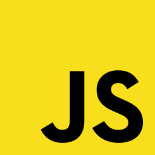

## Hi there, I'm Mikołaj 👋

```css
👨‍💻 developer-type: frontend;
👶 experience: junior;
👨‍🎓 student: warsaw-university-of-technology;
🔨 favourite-tool: react-js;
🚀 wants-to-contribute: true;
```

#### Languages and tools

<div>



</div>

<br><br>


